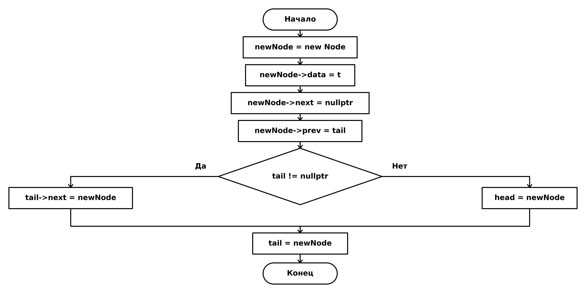
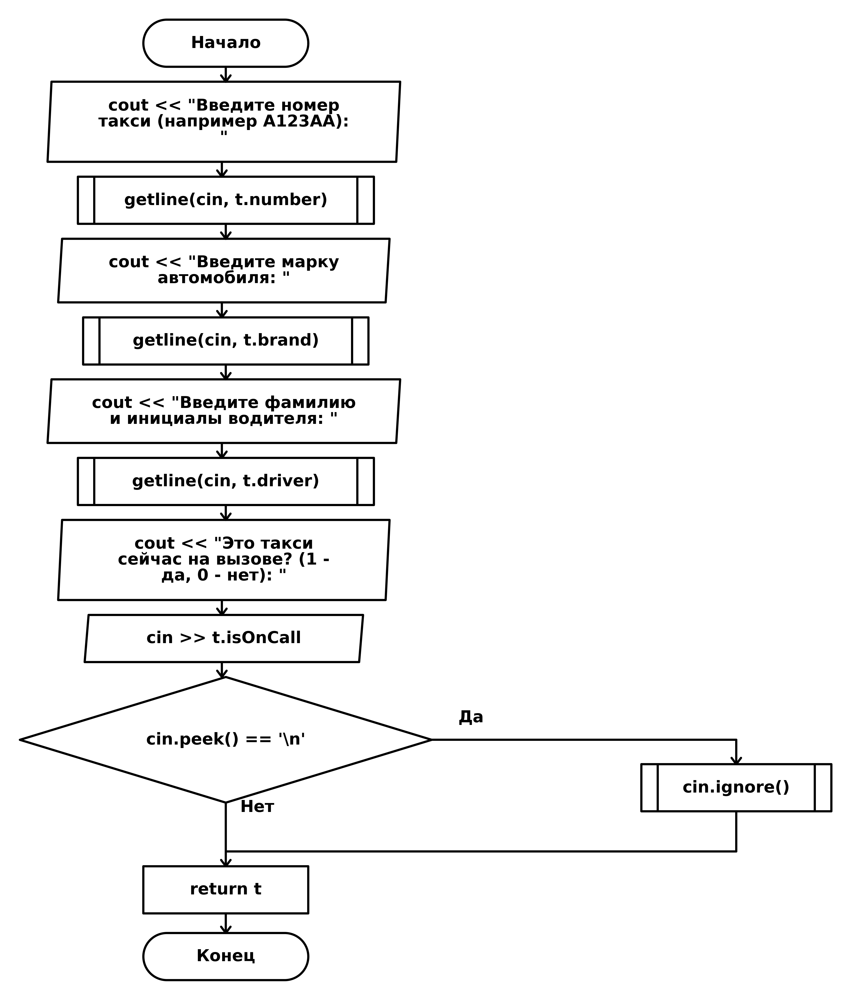
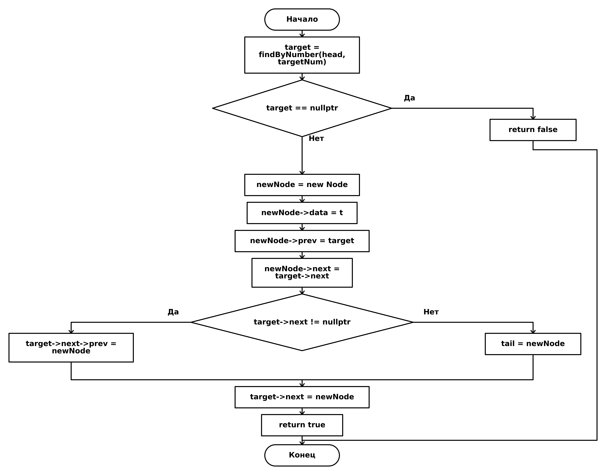

# C++ to GOST Flowchart Generator

Утилита для автоматической генерации блок-схем по исходному коду на языке C++. Блок-схемы строятся максимально близко к стандарту **ГОСТ 19.701-90**, что делает инструмент отличным помощником для оформления курсовых и лабораторных работ.

⚠️ **Внимание:** Построение лучше всего подходит для небольших программ и алгоритмов на C++. Сложные абстракции (классы, шаблоны) могут обрабатываться некорректно или сильно раздувать итоговую схему.

## Примеры генерации

Вот несколько примером автоматически сгенерированных блок-схем по функциям C++:

### Добавление элемента в конец списка (`addLast`)

  

### Ввод данных (`inputTaxiData`)

  

### Вставка элемента после заданного (`addAfter`)

  

## Что реализовано (Done) 🟢
- [x] Парсинг базовых конструкций C++: `if/else`, `while`, `do-while`, `for`, `switch`.
- [x] Отрисовка фигур алгоритма в соответствии с ГОСТ 19.701-90 (Терминатор, Процесс, Решение, Данные (ввод/вывод), Предопределенный процесс).
- [x] Поддержка вложенных структур и корректная маршрутизация линий соединения.
- [x] Компактная вертикальная отрисовка `switch-case` блоков.
- [x] Экспорт результатов в популярные графические форматы (PNG / SVG).
- [x] Автоматический перенос длинного текста внутри блоков алгоритма.

## Что не сделано (To-Do) 🟡
- [ ] Поддержка объектно-ориентированного программирования (методы классов).
- [ ] Генерация ГОСТ-рамки (штампа формуляра) вокруг итоговой блок-схемы.
- [ ] Оптимизация разбиения очень длинных алгоритмов на несколько страниц с соединителями.
- [ ] Поддержка тернарных операторов.

## Известные косяки (Known Issues / Flaws) 🔴
- При сильной и глубокой вложенности (5+ уровней) блок-схема может становиться слишком широкой ("эффект Пизанской башни").
- Изредка линии соединения могут накладываться друг на друга, если в одной точке сливается слишком много сложных ветвлений.
- Парсинг макросов C++ и сложных `typedef`/`namespace` может привести к пропуску блоков кода.
- Сложные `switch` с `fallthrough` поведением (провал в следующий case без `break`) не поддерживаются корректно (схема рисуется как для обычных case).

## Использование

1. Установите зависимости: `pip install schemdraw tree-sitter tree-sitter-cpp matplotlib`.
2. Поместите ваш C++ код в текстовый файл (например, `kod.txt`).
3. Запустите генератор: `python main_vertical.py`.
4. Блок-схемы для каждой функции появятся в папке `flowcharts_kod`.
